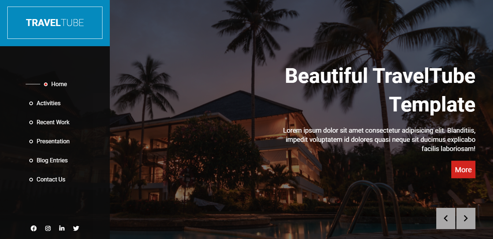
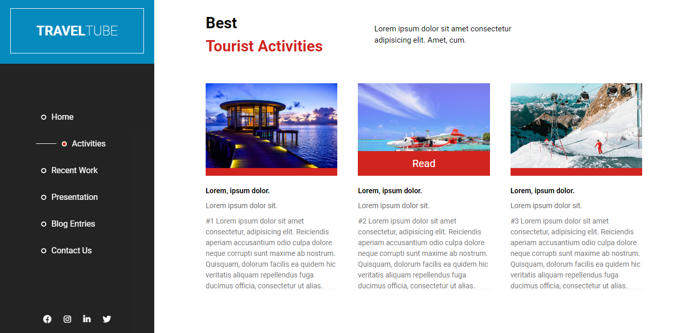
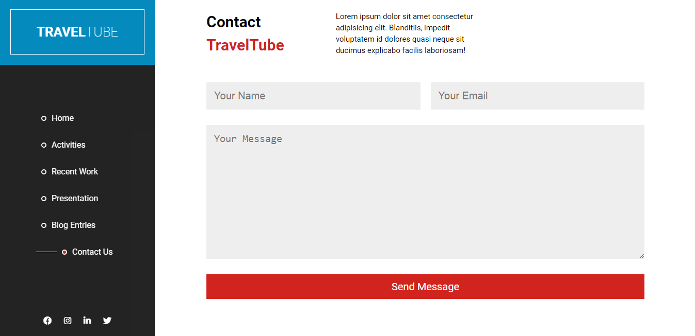
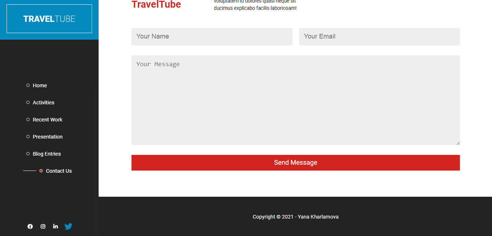
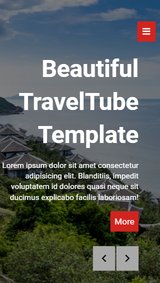

# TravelTube
## Project Description
TravelTube is my vision of nice tour company website with good usability and well-formatted content, that is easy to scan.

It`s also responsive for large, medium and small screen sizes.

Live version:
## Features:
My website contains:
* animated sidebar to navigate TravelTube sections (also can be hidden on the medium/small screen sizes);
* image slider with best resorts;
* image gallery of top hotels;
* blog with sorted articles;
* responsive design.
## Built with:
* HTML
* CSS
* SCSS
* JS
* BEM

  "7-1" pattern was also used
## Application Sass structure:

## Screenshots:
**1.**

**2.**

**3.**

**4.**

**5.**

**6.**

**7.**

**8.**

**9.**

**10.**

**11.**

**12.**

**13.**

**14.**

